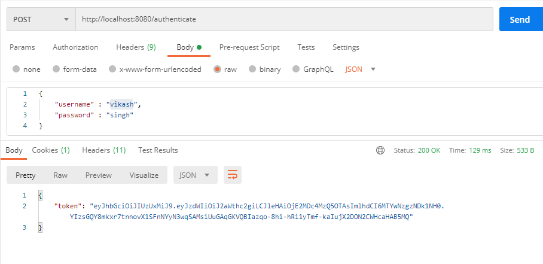
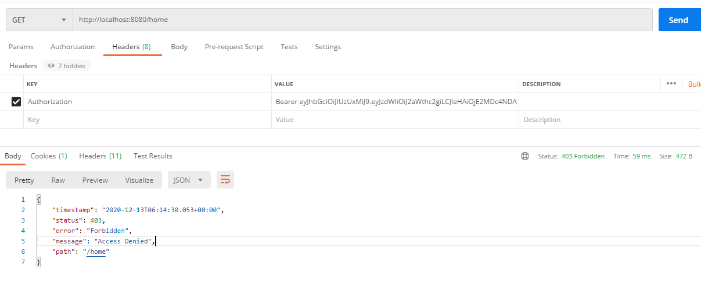
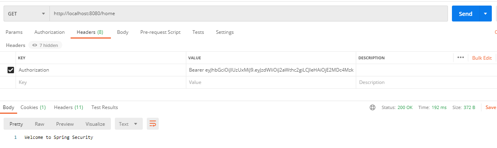

# Spring-security-jwt-tutorial

## Spring-security-jwt-tutorial is an example of Spring Boot Application for Securing a REST API with JWT (JSON Web Token).

We will see how to secure rest API through JWT token in basic way.

## Setup project

**Modules used for Application**

* JAVA 8
* Spring boot
* h2-database

**Dependency**

* Spring Web
* Data JPA
* H2-Database
* Spring Security
* JWT
* Devtool

**Enable Spring Security for Spring boot App**

As we know by adding Spring security dependency by default Spring gives us a login page and working as protecting our App. But there has some issue, that is username of the loging page is by default **user** and password will be generate on console page like given below.

	Using generated security password: 937e8fe0-cff5-4b1c-bc00-59c3c44d6c2a

You can customize the **Username** and **password** from **application.properties** which is given below :

	spring.security.user.name= vikash
	spring.security.user.password= pass
	
Before start JWT token implementation we will see quick review on http basic authentication using Spring Security.

## Http Basic Authentication

**WebSecurityConfigurerAdapter**

We can either implements the interface called WebSecurityConfigurer or extend the more convenient class called WebSecurityConfigurerAdapter. The advantage of extending the adapter class is that we can configure Web security by overriding only those parts that we are interested in; others can remain their default form.

	// The annotation @EnableWebSecurity enables Web security; otherwise, it remains disabled by default.
	@Configuration
	@EnableWebSecurity
	public class SecurityConfig extends WebSecurityConfigurerAdapter {
	}

We need to override configure(AuthenticationManagerBuilder auth) method to customize or validate user details before handle to the spring to login it.

	@Autowired
	private CustomUserDetailsService userDetailsService;
	
	@Override
	protected void configure(AuthenticationManagerBuilder auth) throws Exception {
		auth.userDetailsService(userDetailsService);
	}
	
For password Encoding we need to create the bean of PasswordEncoder.

	@Bean
	public PasswordEncoder passwordEncoder() {
		// If you don't want to use BCrypt password you can use NoOpPasswordEncoder but it is deprecated :
		return NoOpPasswordEncoder.getInstance()
	}
	
To Authenticate the user we need to implement UserDetailsService interface.

	@Service
	public class CustomUserDetailsService implements UserDetailsService {
	
		@Override
		public UserDetails loadUserByUsername(String username) throws UsernameNotFoundException {
			return new User("vikash", "pass", new ArrayList<>());
		}
	}

**Note :** There is hard coded user credentials, To implement login through database we need to add some more code is given below:

## Database Authentication 

**User Entity :**

We will create a entity class called **User** there has already created *User* class in package *org.springframework.security.core.userdetails.User* so you can create with different bean name.

Here we are using Hibernate so we will use of their annotation:

	@Entity
	public class User {
		@Id
		@GeneratedValue(strategy = GenerationType.AUTO)
		private Long id;
		private String userName;
		private String password;
		private String email;
		// Constructor and Setter & Getter
	}

**User Repository**

Here we will create UserRepository with implement JpaRepository interface.

	@Repository
	public interface UserRepository extends JpaRepository<User, Long> {
		Optional<User> findByUserName(String userName);
	}

**Load userDetails from Database :**

	@Service
	public class CustomUserDetailsService implements UserDetailsService {
		
		@Autowired
		private UserRepository userRepository;
		
		@Override
		public UserDetails loadUserByUsername(String username) throws UsernameNotFoundException {
			Optional<User> userOptional = userRepository.findByUserName(username);
			User user = userOptional.orElseThrow(() -> new UsernameNotFoundException("Username not found"));
			return new org.springframework.security.core.userdetails.User(user.getUserName(), user.getPassword(),
					new ArrayList<>());
		}
	}

**Add the users at the Application running time**

	@PostConstruct
	public void init() {
		List<User> users = Stream.of(new User("vikash", "singh", "vikash@gmail.com"),
				new User("user1", "pass1", "user1@gmail.com"), new User("user2", "pass2", "user2@gmail.com"),
				new User("user3", "pass3", "user3@gmail.com"), new User("user4", "pass4", "user4@gmail.com"))
				.collect(Collectors.toList());
		userRepository.saveAll(users);
	}

## How to Authenticate Rest Api with JWT token

Create a JWTUtil class to generate token and manage token expiration time and all.

	@Service
	public class JwtUtil implements Serializable {
	
		private static final long serialVersionUID = -2550185165626007488L;
	
		private String SECRET_KEY = "secret";
	
		public static final long JWT_TOKEN_VALIDITY = 10 * 60 * 60;
	
		// retrieve username from jwt token
		public String getUsernameFromToken(String token) {
			return getClaimFromToken(token, Claims::getSubject);
		}
	
		// retrieve expiration date from jwt token
		public Date getExpirationDateFromToken(String token) {
			return getClaimFromToken(token, Claims::getExpiration);
		}
	
		public <T> T getClaimFromToken(String token, Function<Claims, T> claimsResolver) {
			final Claims claims = getAllClaimsFromToken(token);
			return claimsResolver.apply(claims);
		}
	
		// for retrieveing any information from token we will need the secret key
		private Claims getAllClaimsFromToken(String token) {
			return Jwts.parser().setSigningKey(SECRET_KEY).parseClaimsJws(token).getBody();
		}
	
		// check if the token has expired
		private Boolean isTokenExpired(String token) {
			final Date expiration = getExpirationDateFromToken(token);
			return expiration.before(new Date());
		}
	
		// generate token for user
		public String generateToken(UserDetails userDetails) {
			Map<String, Object> claims = new HashMap<>();
			return doGenerateToken(claims, userDetails.getUsername());
		}
	
		// while creating the token -
		// 1. Define claims of the token, like Issuer, Expiration, Subject, and the ID
		// 2. Sign the JWT using the HS512 algorithm and secret key.
		// 3. According to JWS Compact
		// Serialization(https://tools.ietf.org/html/draft-ietf-jose-json-web-signature-41#section-3.1)
		// compaction of the JWT to a URL-safe string
		private String doGenerateToken(Map<String, Object> claims, String subject) {
			return Jwts.builder().setClaims(claims).setSubject(subject).setIssuedAt(new Date(System.currentTimeMillis()))
					.setExpiration(new Date(System.currentTimeMillis() + JWT_TOKEN_VALIDITY))
					.signWith(SignatureAlgorithm.HS512, SECRET_KEY).compact();
		}
	
		// validate token
		public Boolean validateToken(String token, UserDetails userDetails) {
			final String username = getUsernameFromToken(token);
			return (username.equals(userDetails.getUsername()) && !isTokenExpired(token));
		}
	}

**Create a request bean to get username and password**

	public class JwtRequest implements Serializable {
		private static final long serialVersionUID = 5926468583005150707L;
		
		private String username;
		private String password;
		
		//need default constructor for JSON Parsing
		public JwtRequest()	{}
	
		public JwtRequest(String username, String password) {
			this.setUsername(username);
			this.setPassword(password);
		}
		
		//Create Getter and Setter
	}	

**To return the tokean as response we will create a JwtResponse bean**

	public class JwtResponse implements Serializable {

		private static final long serialVersionUID = -8091879091924046844L;
		private final String jwttoken;
	
		public JwtResponse(String jwttoken) {
			this.jwttoken = jwttoken;
		}
	
		public String getToken() {
			return this.jwttoken;
		}
	}

**To get the token we need to create a api that is "/authenticate"**

	@PostMapping(value = "/authenticate")
	public ResponseEntity<?> createAuthenticationToken(@RequestBody JwtRequest authenticationRequest) throws Exception {

		authenticate(authenticationRequest.getUsername(), authenticationRequest.getPassword());

		final UserDetails userDetails = userDetailsService
				.loadUserByUsername(authenticationRequest.getUsername());

		final String token = jwtUtil.generateToken(userDetails);

		return ResponseEntity.ok(new JwtResponse(token));
	}
	
	private void authenticate(String username, String password) throws Exception {
		try {
			authenticationManager.authenticate(new UsernamePasswordAuthenticationToken(username, password));
		} catch (DisabledException e) {
			throw new Exception("USER_DISABLED", e);
		} catch (BadCredentialsException e) {
			throw new Exception("INVALID_CREDENTIALS", e);
		}
	}

**To call the AuthenticationManager we need to create the @Bean and override method in SecurityConfig class.**

	@Bean
	@Override
	public AuthenticationManager authenticationManagerBean() throws Exception {
		return super.authenticationManagerBean();
	}

**Somebody will call the "/authenticate" api so don't expect this API is authenticated. For don't apply authentication on this API we need to override configure(HttpSecurity http) method in SecurityConfig class.**

	@Override
	protected void configure(HttpSecurity http) throws Exception {
		// We don't need CSRF for this example
				http.csrf().disable()
						// dont authenticate this particular request
						.authorizeRequests().antMatchers("/authenticate").permitAll().
						// all other requests need to be authenticated
						anyRequest().authenticated();/*
	}
	
**Now we are good and able to generate token as we can see in given below picture :**

But Still we are not able to call another api with the help of this generated token. So to call another API with the help of this token we need to implement authorized request through JwtFilter.

## Intercept all incoming requests

* Extract JWT from the header
* Validate and set in execution context.

**Add a filter to intercept all incoming requests**

	@Component
	public class JwtRequestFilter extends OncePerRequestFilter {
	
		@Autowired
		private JwtUtil jwtUtil;
		
		@Autowired
		private CustomUserDetailsService customUserDetailsService;
		
		@Override
		protected void doFilterInternal(HttpServletRequest request, HttpServletResponse response, FilterChain filterChain)
				throws ServletException, IOException {
			final String authorizationHeader = request.getHeader("Authorization");
			String username = null;
			String jwt = null;
	
			if (authorizationHeader != null && authorizationHeader.startsWith("Bearer ")) {
				jwt = authorizationHeader.substring(7);
				username = jwtUtil.getUsernameFromToken(jwt);
			}
	
			if (username != null && SecurityContextHolder.getContext().getAuthentication() == null) {
				UserDetails userDetails = this.customUserDetailsService.loadUserByUsername(username);
				if (jwtUtil.validateToken(jwt, userDetails)) {
					UsernamePasswordAuthenticationToken usernamePasswordAuthenticationToken = new UsernamePasswordAuthenticationToken(
							userDetails, null, userDetails.getAuthorities());
					usernamePasswordAuthenticationToken
							.setDetails(new WebAuthenticationDetailsSource().buildDetails(request));
					SecurityContextHolder.getContext().setAuthentication(usernamePasswordAuthenticationToken);
				}
			}
			filterChain.doFilter(request, response);
		}
	}
	
After implemented Jwt request filter, needs to tell to Spring security to don't manage sessionManagement and call the filter before **UsernamePasswordAuthenticationFilter** call as given below in WebSecurityConfigurerAdapter implemented class:

		@Override
	protected void configure(HttpSecurity http) throws Exception {
		// We don't need CSRF for this example
		http.csrf().disable()
				// dont authenticate this particular request
				.authorizeRequests().antMatchers("/authenticate").permitAll().
				// all other requests need to be authenticated
				anyRequest().authenticated()
				//.and().exceptionHandling().authenticationEntryPoint(jwtAuthenticationEntryPoint)
				// make sure we use stateless session; session won't be used to // store user's
				// state.
				.and().sessionManagement().sessionCreationPolicy(SessionCreationPolicy.STATELESS);
	
		http.addFilterBefore(jwtRequestFilter, UsernamePasswordAuthenticationFilter.class);			
				
	}

Now with this we are finally done to Intercept all incoming requests to validate user with token. Run the project and call the another request with valid token as given below:

